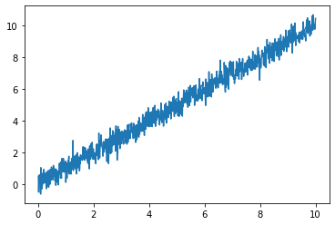

## 给定两组数据,在该数据的基础上进行以下处理:
1. 使用线性函数进行拟合，使用$L2$范数建立对应的优化问题进行求解，建立对应的优化问题后可以使用`cvxpy`或直接通过课程中所讲述的公式进行求解，给出拟合的平均绝对误差和对应拟合公式。
2. 数据使用`scipy.io.loadmat(‘data.mat’)`函数读取, `pip install scipy`即可安装该库。

首先，通过`scipy.io.loadmat`读取需要拟合的两个变量`x.mat, y.mat`：


```python
from scipy.io import loadmat
X = loadmat('x.mat')['x'][0, :]
Y = loadmat('y.mat')['y'][0, :]
```

输出两个变量的维度并画出大致的图像：


```python
print('X dimension: ', X.shape[0])
print('Y dimension: ', Y.shape[0])
import matplotlib.pyplot as plt
plt.figure()
plt.plot(X, Y)
plt.show()
```

    X dimension:  1000
    Y dimension:  1000


    

    


通过上述步骤我们知道，$X,Y$都有$1000$个样本，并且他们之间大致符合线性关系，因此用线性函数拟合是合理的。因此我们可以建立如下的最优化问题：
$$
\mathop{min}\limits_{a,b}\ \lVert aX+b-Y \rVert_2
$$
其中$a,b$均为标量。

通过`python`库`cvxpy`进行求解：


```python
import cvxpy as cp
import numpy as np
a = cp.Variable()
b = cp.Variable()
obj = cp.Minimize(cp.norm(a * X + b - Y))
prob = cp.Problem(obj)
prob.solve()
```


    12.406181785315747


上述输出意为目标函数的最值为$12.406$。

下面输出平均绝对误差及重构公式：


```python
print(f'Mean Absolute Deviation is {np.linalg.norm(a.value * X + b.value - Y, ord=1) / X.shape[0]: .3f}.')
print(f'The reconstruction formula is y = {a.value:.3f}x + {b.value:.3f}.')
```

    Mean Absolute Deviation is  0.314.
    The reconstruction formula is y = 0.994x + 0.029.


即，平均绝对误差为$0.314$；

相对应的重构公式为 $y\ =\ 0.994x\ +\ 0.029$。
